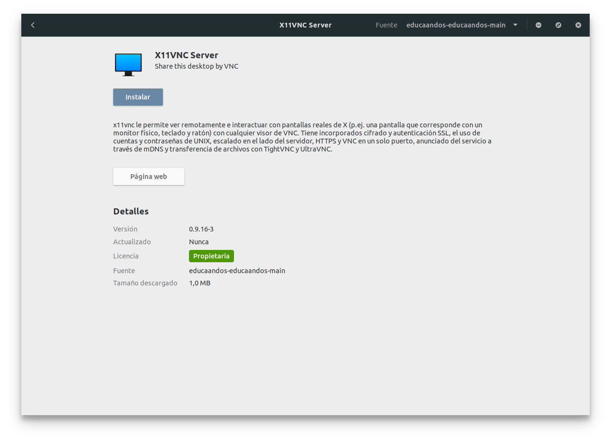
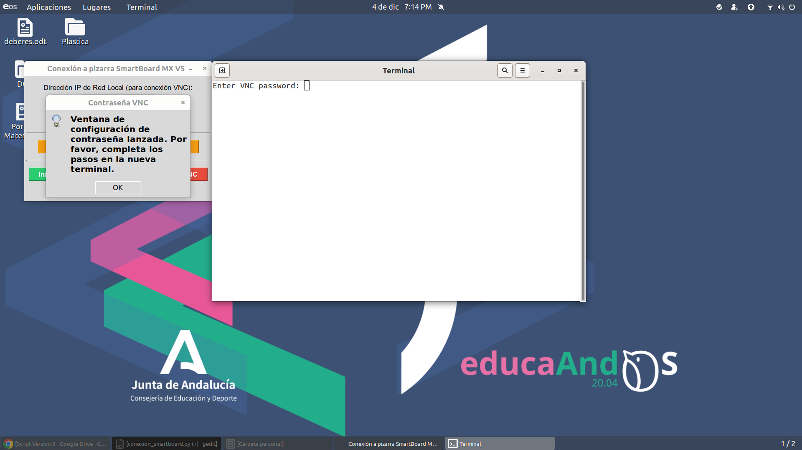
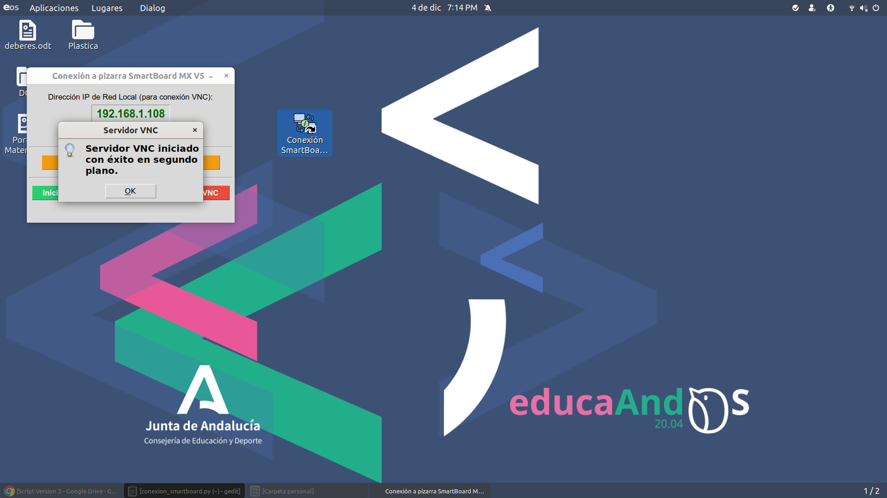

# Conexión Inalámbrica desde una pizarra SmartBoard MX V5 a Educaandos 20.04
Programa sencillo realizado en Python para que cualquier docente, sea o no experimentado en informática, pueda proyectar su PC/portátil de Educaandos 20.04 en las pizarras SmartBoard MX V5 de manera inalámbrica.

## Prerrequisitos
1. Instalar el servidor x11vnc desde el repositorio de Educaandos.

## Instalación del servidor VNC

1. Descargar el archivo **Conexion_SmartBoard.zip**.

[conexion_smartboard.zip](conexion_smartboard.zip)

<a href="conexion_smartboard.zip" download>conexion_smartboard.zip</a>

2. Descomprimir el archivo.

Desde la línea de comandos.
~~~
unzip conexion_smartboard.zip
~~~

3. Muevete a la carpeta descomprimida.

Desde la línea de comandos.
~~~
cd conexion_smartboard
~~~

4. Concede permisos de ejecución al archivo **instalar.sh**
~~~
chmod u+x instalar.sh
~~~
5. Ejecuta el script de instalación
~~~
./instalar.sh
~~~
También con
~~~
bash install.sh
~~~
6. Al finalizar la instalación se cerrará la sesión para aplicar los cambios.

## Ejecución y configuración del Servidor VNC
Esto lo hacemos en nuestro portátil o PC con Educaandos.

<!--1. En el icono del escritorio **Conexión SmartBoard** mostrar el menú contextual y seleccionar la opción **Permitir Lanzar**.-->
1. Iniciar la aplicación **Conexión SmartBoard** desde el icono del escritorio. También es puedes hacerlo desde el menú aplicaciones.

2. En la pantalla de la aplicación se muestra la dirección IP actual del equipo y cuatro botones:

- Ver/Actualizar IP
- Configurar/Cambiar Contraseña VNC
- Iniciar Servidor VNC
- Parar Servidor VNC

3. (Opcional) Actualizar la dirección IP si es que hubiera cambiado desde que se inició el programa.

4. Configurar la contraseña del servidor VNC. Esto lo hacemos por seguridad para que no pueda conectarse cualquiera a nuestro PC o portátil Educaandos.

3. Iniciar el servidor VNC.

4. Conectase desde el cliente VNC.

Ir al apartado [Instalación y Configuración del Cliente VNC.](#instalación-y-configuración-del-cliente-vnc)

5. Parar el servidor VNC cuando hayamos terminado.

## Instalación y configuración del cliente VNC
Esto lo hacemos en nuestra pizarra SmartBoard MX V5

1. Instalamos un cliente VNC (Ej. RealVNC Viewer) desde el repositorio de apliciones Play Store.

   
2. Iniciamos RealVNC.
<!---->

4. Añadimos una nueva conexión.     Clicar en el icono **+**.

5. Añadimos la IP de nuestro servidor VNC y el puerto de escucha (normalmente 5900). Además añadimos el nombre del equipo. Pulsar **Create**.

6. Nos saldra una pantalla con el resumen de la conexión. Pulsar **Connect**.

7. En la siguiente pantalla nos muestra una advertencia de conexión no encriptada **Unencrypted connection**. Si quieres desactiva la advertencia para conexiones sucesivas desactivando **Warn me every time**.

8. Introduce la contraseña configurada anteriormente para el servidor. Pulsar **Continue**.

9. Ya estamos conectados a nuestro equipo Educaandos. Ahora se podrá ver en la pizarra todo lo que hagamos en nuestro PC. Incluso es posible manejar el equipo desde la pizarra.

